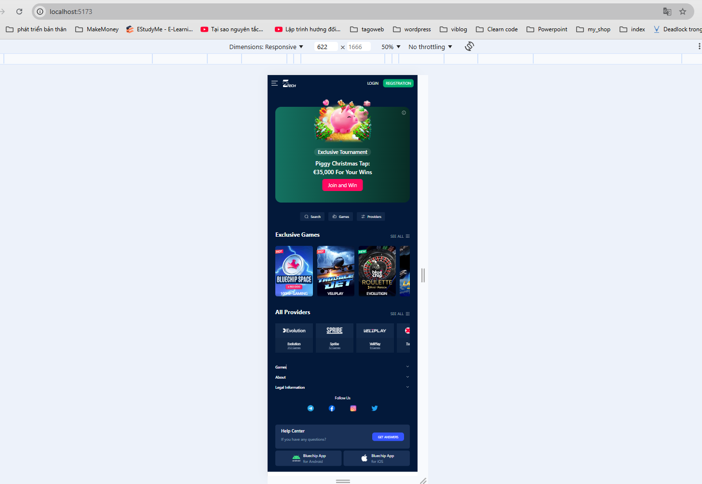

# NevelTech Vite Project


## Overview

This project is a modern web application built using React and Vite. It leverages the power of Vite for fast development and optimized builds, along with React for building user interfaces.

## Features

- **React**: A JavaScript library for building user interfaces.
- **Vite**: A build tool that provides a fast development environment and optimized production builds.
- **Tailwind CSS**: A utility-first CSS framework for rapid UI development.

## Installation

To get started with the project, follow these steps:

1. **Clone the repository**:
    ```bash
    git clone https://github.com/your-username/neveltech-vite-project.git
    cd neveltech-vite-project
    ```

2. **Install dependencies**:
    ```bash
    npm install
    ```

3. **Start the development server**:
    ```bash
    npm run dev
    ```

4. **Build for production**:
    ```bash
    npm run build
    ```

5. **Preview the production build**:
    ```bash
    npm run serve
    ```

## Screenshots

### Mobile View


### PC View

